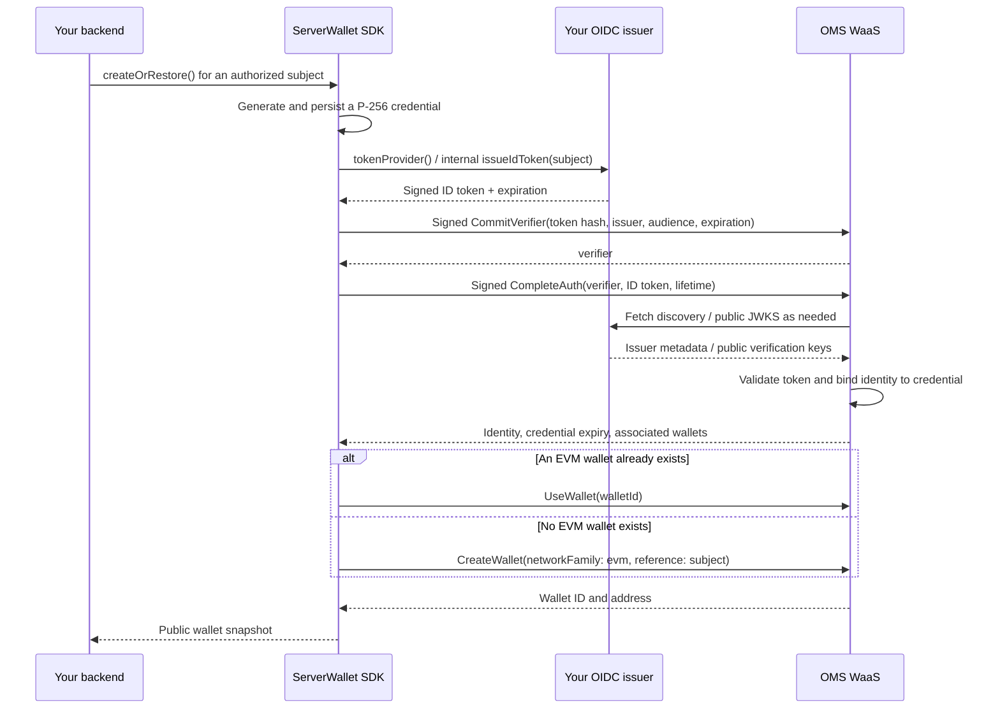

# Node.js / TypeScript wallet integration walkthrough

This guide shows how to use `@polygonlabs/oms-server-wallet-sdk` from npm in your own backend: configure OpenID Connect (OIDC), create or restore a wallet, sign a message, and send a sponsored native-token or ERC-20 transfer. It targets SDK `0.1.0` and its WaaS v1.1.0 protocol. You can use it without cloning this repository, running the dashboard, or using Cloudflare.

**Your backend supplies a trusted identity; the SDK authenticates a credential for that identity; WaaS performs wallet signing.** You provide OpenID information in two places: register your issuer and audience with OMS once, then provide a fresh signed ID token through the SDK's `tokenProvider` whenever authentication is needed.

The examples below build a small standalone Node application. For an existing backend, move the same functions into your services and call them only after your application's authentication and authorization checks.

Quick links: [OIDC registration](#2-arrange-the-oms-project-and-oidc-registration), [SDK setup](#3-install-the-standalone-sdk), [authentication exchange](#6-what-happens-during-oidc-authentication), [create, sign, and send](#7-create-a-wallet-sign-prepare-send-and-check-status).

## 1. Understand the identities, keys, and “session ID”

| Item                        | Meaning in this implementation                                                                                | Who supplies it?                                              |
| --------------------------- | ------------------------------------------------------------------------------------------------------------- | ------------------------------------------------------------- |
| `OIDC_ISSUER` / JWT `iss`   | Stable public HTTPS URL identifying your token issuer.                                                        | Your backend; registered with OMS.                            |
| `OIDC_AUDIENCE` / JWT `aud` | Exact audience accepted by your registered OMS provider.                                                      | Agreed with OMS during registration.                          |
| `subject` / JWT `sub`       | Immutable application identifier, such as `customer:12345`. The SDK manages one EVM wallet for this identity. | Your application.                                             |
| ID token                    | Short-lived signed JWT asserting `iss`, `aud`, and `sub`.                                                     | Your backend issuer in this guide.                            |
| Issuer signing key          | P-256 private key used to sign ID tokens. Its public half appears in JWKS.                                    | Generated and retained by your backend.                       |
| WaaS credential             | Separate P-256 key pair authorizing SDK requests for a limited lifetime.                                      | Generated, encrypted, and managed by the SDK on your backend. |
| `snapshot.credentialId`     | WaaS identifier for that credential; useful when inspecting its lifecycle.                                    | Computed by the SDK and checked against WaaS's response.      |
| Wallet ID / address         | WaaS wallet identifier and public EVM address. These survive credential renewal.                              | Returned by WaaS.                                             |
| Operation ID                | Your durable idempotency key for one signing or transfer request.                                             | Your application.                                             |
| `quote.txnId` / `txnHash`   | WaaS transaction reference / eventual blockchain transaction hash.                                            | Returned by WaaS.                                             |

**There is no `sessionId` argument to create, sign, or send with this SDK.** The closest concept is the authenticated WaaS credential. `createOrRestore()` establishes it automatically, and later operations reuse it. Do not generate a session ID or substitute a wallet ID, JWT `jti`, or operation ID for a credential.

The request header uses the credential's raw public key internally; `snapshot.credentialId` is a SHA-256-derived identifier, not that raw key. Leave both request construction and nonce management to the SDK. The dashboard's admin cookie and `SESSION_SECRET` belong to its separate login system; your standalone integration does not need them.

There are three distinct kinds of signing:

1. Your issuer signs an **ID token** to assert an identity.
2. The SDK's credential signs **HTTP requests** to authorize WaaS operations.
3. WaaS uses the **wallet's signing keys** to sign messages and execute transactions. Those keys are not returned to your backend.

Your backend controls who can request wallet operations. Derive `sub` from an authorized account record; do not let an unauthenticated caller select an arbitrary subject. Use a stable identifier of 1–128 characters, and keep the project, environment, issuer, audience, and subject mapping stable. Changing that mapping is an identity migration, not a way to restore an existing wallet.

## 2. Arrange the OMS project and OIDC registration

Before calling the wallet API, arrange these settings with the OMS project owner:

| Setting                | What to provide or obtain                                                                                                                     |
| ---------------------- | --------------------------------------------------------------------------------------------------------------------------------------------- |
| OMS publishable key    | A key for your own project/environment. The SDK derives the gateway URL and project scope from it.                                            |
| Issuer                 | For example, `https://wallet-api.example.com`, with no trailing slash.                                                                        |
| Discovery URL          | `https://wallet-api.example.com/.well-known/openid-configuration`.                                                                            |
| JWKS URL               | `https://wallet-api.example.com/oidc/jwks`, serving **public keys only**.                                                                     |
| Audience               | The exact registered string. It must match the JWT and `ServerWallet` configuration.                                                          |
| Identity configuration | Custom OIDC provider, `identityType: oidc`, `authMode: id-token`, ES256 signing, and permission to use your chosen subjects.                  |
| Application origin     | The origin allowed for your OMS key, for example `https://wallet-api.example.com`. The examples send it as the `Origin` header.               |
| Enclave trust policy   | Approved PCR0 measurements for the selected deployment, supplied independently by its operator. Each is 48 bytes / 96 hexadecimal characters. |
| Gas sponsorship        | Enable sponsorship for the networks on which you intend to send transfers. This SDK rejects unsponsored quotes.                               |

You can deploy the issuer endpoints in step 4 before wallet access is enabled. Ask the OMS operator to register the issuer once the endpoints are reachable. This repo contains no provider-registration API or command; use the operator's current process. Send the registration settings and public URLs, never the issuer private key or encryption key.

The existing demo's registration uses audience `api.dev.polygon-dev.technology`; its sandbox gateway has a different hostname. **Do not derive the audience from the gateway URL or copy the demo's identity settings into your own project.** Confirm your assigned audience. The [demo registration record](oms-dev-registration.json) shows the shape of the information to exchange.

The networks currently accepted by the SDK are Polygon (`137`), Arbitrum (`42161`), Base (`8453`), BNB Chain (`56`), and Ethereum (`1`). These are **mainnets**, even when an OMS key selects a dev or sandbox service. Sponsorship covers gas; your wallet still needs the asset being transferred.

### How this uses OpenID Connect

This repo implements a **backend-only ID-token issuer** accepted by a registered OMS provider. It publishes discovery and JWKS, and mints tokens internally. It does not implement a general-purpose interactive OpenID Provider, browser redirects, an authorization-code exchange, or a public token endpoint.

The ID token carries identity claims; the meaning of `iss`, `sub`, `aud`, `iat`, and `exp` follows [OpenID Connect's ID Token definition](https://openid.net/specs/openid-connect-core-1_0.html#IDToken). An application login cookie, OAuth access token, or OMS publishable key cannot simply be substituted for this ID token.

If you already have an identity provider, confirm its issuer, audience, token-signing algorithm, and subject policy are accepted by your OMS project. You can then implement `tokenProvider` using that provider's supported ID-token flow. It must supply a valid token for the **same subject** whenever the SDK reauthenticates. The examples here use this repo's ES256 backend-issued approach; they require no OAuth client secret, redirect URI, or refresh token.

## 3. Install the standalone SDK

Use Node **24+** and install the SDK directly from npm in your backend:

```sh
npm install @polygonlabs/oms-server-wallet-sdk@0.1.0
```

Version `0.1.0` is the initial release; its API is not yet declared stable. The examples pin this version. For a new example application, run the following commands in a directory of your choice:

```sh
mkdir oms-node-example
cd oms-node-example
npm init -y
npm pkg set type=module
npm install @polygonlabs/oms-server-wallet-sdk@0.1.0 jose@6.2.10
npm install --save-dev typescript@5.9.3 tsx@4.23.13 @types/node@24
mkdir src
```

Use this `tsconfig.json`:

```json
{
  "compilerOptions": {
    "target": "ES2022",
    "lib": ["ES2022", "DOM", "DOM.Iterable"],
    "module": "NodeNext",
    "moduleResolution": "NodeNext",
    "strict": true,
    "skipLibCheck": true,
    "noEmit": true,
    "types": ["node"]
  },
  "include": ["src/**/*.ts"]
}
```

Add `.env`, `.data/`, and `node_modules/` to your application's `.gitignore`.

### Generate the secrets once

Create `setup-secrets.mjs` in the example application:

```js
import { randomBytes } from 'node:crypto';
import { writeFile } from 'node:fs/promises';
import { exportJWK, generateKeyPair } from 'jose';

const { privateKey } = await generateKeyPair('ES256', { extractable: true });
const jwk = await exportJWK(privateKey);
await writeFile(
  '.env',
  [
    `OIDC_PRIVATE_JWK='${JSON.stringify(jwk)}'`,
    `ENCRYPTION_KEY=${randomBytes(32).toString('base64')}`,
    'OIDC_ISSUER=https://wallet-api.example.com',
    'OIDC_AUDIENCE=replace-with-your-registered-audience',
    'OMS_PUBLISHABLE_KEY=replace-with-your-project-key',
    'TRUSTED_PCR0S=replace-with-operator-approved-pcr0s',
    'APP_ORIGIN=https://wallet-api.example.com',
    'DATABASE_PATH=.data/wallets.sqlite',
    '',
  ].join('\n'),
  { flag: 'wx', mode: 0o600 },
);
console.log('Created .env. Configure its non-generated values before continuing.');
```

Run `node setup-secrets.mjs`, then edit the placeholders in `.env`. The script refuses to overwrite an existing file. In a deployed service, supply these values through your secret/configuration system. Keep `ENCRYPTION_KEY` with your database backups; replacing it makes existing encrypted state unreadable. Keep the issuer key stable across restarts and deployments too.

## 4. Implement and publish the issuer

Create `src/oidc.ts`. This follows [the repository's issuer](../apps/server/issuer.ts), with configuration narrowed to what the standalone application needs:

```ts
import { randomUUID } from 'node:crypto';
import { SignJWT, calculateJwkThumbprint, importJWK, type JWK } from 'jose';

export function required(name: string): string {
  const value = process.env[name];
  if (!value) throw new Error(`Missing configuration: ${name}`);
  return value;
}

export const issuer = required('OIDC_ISSUER').replace(/\/$/, '');
export const audience = required('OIDC_AUDIENCE');
// This example hosts discovery at the root of a dedicated HTTPS origin.
if (new URL(issuer).protocol !== 'https:' || new URL(issuer).origin !== issuer) {
  throw new Error('OIDC_ISSUER must be an HTTPS origin without a path.');
}

const privateJwk: JWK = JSON.parse(required('OIDC_PRIVATE_JWK'));
if (
  privateJwk.kty !== 'EC' ||
  privateJwk.crv !== 'P-256' ||
  !privateJwk.x ||
  !privateJwk.y ||
  !privateJwk.d
) {
  throw new Error('OIDC_PRIVATE_JWK must be a private P-256 JWK.');
}
const signingKey = await importJWK(privateJwk, 'ES256');
// Select public fields explicitly so private material cannot enter JWKS.
const publicJwk = {
  kty: privateJwk.kty,
  crv: privateJwk.crv,
  x: privateJwk.x,
  y: privateJwk.y,
};
const kid = await calculateJwkThumbprint(publicJwk);

export const jwks = { keys: [{ ...publicJwk, kid, use: 'sig', alg: 'ES256' }] };
export const discovery = {
  issuer,
  jwks_uri: `${issuer}/oidc/jwks`,
  id_token_signing_alg_values_supported: ['ES256'],
  subject_types_supported: ['public'],
  claims_supported: ['iss', 'aud', 'sub', 'iat', 'exp', 'jti'],
};

// Internal function: call only for an identity your backend may operate.
export async function issueIdToken(subject: string) {
  if (!subject || subject.length > 128) throw new Error('Invalid subject.');
  const now = Math.floor(Date.now() / 1000);
  const expiresAt = now + 300;
  const token = await new SignJWT({})
    .setProtectedHeader({ alg: 'ES256', kid, typ: 'JWT' })
    .setIssuer(issuer)
    .setAudience(audience)
    .setSubject(subject)
    .setIssuedAt(now)
    .setExpirationTime(expiresAt)
    .setJti(randomUUID())
    .sign(signingKey);
  return { token, expiresAt }; // Unix seconds, not milliseconds.
}
```

Create `src/issuer-server.ts` to serve the two public endpoints:

```ts
import { createServer } from 'node:http';
import { discovery, jwks } from './oidc.js';

createServer((request, response) => {
  const path = new URL(request.url ?? '/', 'http://localhost').pathname;
  const body =
    path === '/.well-known/openid-configuration'
      ? discovery
      : path === '/oidc/jwks'
        ? jwks
        : undefined;
  if (request.method !== 'GET' || !body) {
    response.writeHead(404).end();
    return;
  }
  response.writeHead(200, {
    'Content-Type': 'application/json',
    'Cache-Control': 'public, max-age=300',
  });
  response.end(JSON.stringify(body));
}).listen(3000, '127.0.0.1');
```

Run it with:

```sh
node --import tsx --env-file=.env src/issuer-server.ts
```

Put an HTTPS reverse proxy in front of port 3000 at your configured issuer hostname, or mount the two handlers in your existing publicly reachable backend. WaaS must be able to fetch the endpoints without application login, redirects, or private-network access. A laptop's `localhost` is not a usable issuer for remote WaaS. Local wallet code can use a deployed issuer if its private signing key matches that issuer's published public key.

Verify the deployed endpoints, then complete the registration from step 2:

```sh
curl --fail https://wallet-api.example.com/.well-known/openid-configuration
curl --fail https://wallet-api.example.com/oidc/jwks
```

Check that discovery's `issuer` exactly matches JWT `iss`, that `jwks_uri` is reachable, and that JWKS contains `kty`, `crv`, `x`, `y`, `kid`, `alg`, and `use` but **no `d`**. JWT headers use that same `kid`. There is deliberately no HTTP endpoint that accepts a subject and hands out a token; `issueIdToken()` stays inside your trusted backend.

For issuer-key rotation, publish the next public key before switching signers, allow for OMS's JWKS cache, and retain the old public key until old tokens and caches have expired. The repo's issuer supports overlapping keys through `OIDC_ADDITIONAL_PUBLIC_JWKS`; the minimal example above publishes one key.

## 5. Connect the SDK to durable storage

Create `src/wallets.ts`. This example uses Node's [built-in SQLite API](https://nodejs.org/api/sqlite.html) and is intended for **one wallet-processing Node process**. Each identity gets its own encrypted namespace and one shared executor.

```ts
import { mkdirSync } from 'node:fs';
import { dirname, resolve } from 'node:path';
import { DatabaseSync } from 'node:sqlite';
import {
  EncryptedStore,
  SerialExecutor,
  ServerWallet,
  WaasTransport,
  environmentFromKey,
  type StateStore,
} from '@polygonlabs/oms-server-wallet-sdk';
import { audience, issuer, issueIdToken, required } from './oidc.js';

const filename = resolve(process.env.DATABASE_PATH ?? '.data/wallets.sqlite');
mkdirSync(dirname(filename), { recursive: true, mode: 0o700 });
const db = new DatabaseSync(filename);
db.exec(`
  PRAGMA journal_mode = WAL;
  PRAGMA synchronous = FULL;
  CREATE TABLE IF NOT EXISTS wallet_state (
    namespace TEXT NOT NULL,
    key TEXT NOT NULL,
    value TEXT NOT NULL,
    PRIMARY KEY (namespace, key)
  );
`);

class SqliteStore implements StateStore {
  constructor(private readonly namespace: string) {}
  async read(key: string): Promise<string | null> {
    const row = db
      .prepare('SELECT value FROM wallet_state WHERE namespace = ? AND key = ?')
      .get(this.namespace, key) as { value: string } | undefined;
    return row?.value ?? null;
  }
  async write(key: string, value: string): Promise<void> {
    db.prepare(
      `
      INSERT INTO wallet_state (namespace, key, value) VALUES (?, ?, ?)
      ON CONFLICT(namespace, key) DO UPDATE SET value = excluded.value
    `,
    ).run(this.namespace, key, value);
    // The autocommit completes before this promise resolves.
  }
}

const publishableKey = required('OMS_PUBLISHABLE_KEY');
const encryptionKey = required('ENCRYPTION_KEY');
const environment = environmentFromKey(publishableKey);
const origin = new URL(required('APP_ORIGIN')).origin;
export const omsFetch: typeof fetch = (input, init) => {
  const headers = new Headers(
    init?.headers ?? (input instanceof Request ? input.headers : undefined),
  );
  headers.set('Origin', origin);
  return fetch(input, { ...init, headers });
};
const transport = new WaasTransport(
  publishableKey,
  required('TRUSTED_PCR0S')
    .split(',')
    .map((value) => value.trim())
    .filter(Boolean),
  omsFetch,
);

const clients = new Map<string, ServerWallet>();
export function getWallet(subject: string): ServerWallet {
  // JSON encoding avoids collisions between components of the namespace.
  const namespace = JSON.stringify([
    environment.origin,
    environment.projectId,
    issuer,
    audience,
    subject,
  ]);
  let wallet = clients.get(namespace);
  if (!wallet) {
    wallet = new ServerWallet({
      subject,
      issuer,
      audience,
      tokenProvider: () => issueIdToken(subject),
      store: new EncryptedStore(new SqliteStore(namespace), encryptionKey, namespace),
      executor: new SerialExecutor(),
      transport,
    });
    clients.set(namespace, wallet);
  }
  return wallet;
}
```

This stores encrypted SDK records, including the credential private key, request nonce, wallet mapping, and operation results. Your application should also persist the relationship between its business requests and operation IDs. Returning an ID to the caller is not a substitute for saving that relationship before an operation starts.

`StateStore.write()` must finish durable persistence before resolving. Reuse the same namespace, encryption context, and encryption key after restarts. Do not replace this with an in-memory map or make a fresh namespace per request.

`SerialExecutor` holds exclusive ownership through the whole operation, including network calls. Multiple Node processes, PM2 cluster workers, containers, or replicas must use a coordinator with equivalent ownership per identity, including crash recovery. A shared SQL database or independently allocated nonces alone does not provide that guarantee. Do not run the example's wallet commands concurrently. The issuer-only HTTP server can run separately because it does not access SDK state.

`WaasTransport` handles API-key routing, signed requests, replay protection, and attestation verification. Keep the operator-approved PCR0 policy; there is no attestation bypass. The demo's all-zero debug measurement was approved for its particular dev deployment and must not be copied as a default for another deployment.

## 6. What happens during OIDC authentication?

Calling `await getWallet('customer:12345').createOrRestore()` drives this exchange:



The exact authentication payloads are assembled in [the SDK client](../packages/server-wallet-sdk/src/client.ts):

1. Generate the credential locally and save it encrypted **before** remote use. This key is separate from your OIDC issuer key.
2. Ask `tokenProvider` for `{ token, expiresAt }`. The issuer's token lasts five minutes in this example; `expiresAt` is its `exp` in Unix **seconds**.
3. Call `CommitVerifier` with `identityType: 'oidc'`, `authMode: 'id-token'`, `handle: base64url(SHA-256(token))`, and `metadata: { iss, aud, exp: String(expiresAt) }`. WaaS returns a `verifier`.
4. Call `CompleteAuth` using the same credential, with `identityType: 'oidc'`, `authMode: 'id-token'`, that `verifier`, `answer: token`, and requested `lifetime: 21600` seconds by default.
5. WaaS validates the commitment and ID token against the registered provider and binds the identity to the credential. The SDK checks the returned issuer, subject, and credential ID, follows wallet-list pagination if needed, then restores the single EVM wallet or creates it.

Both auth calls are signed with the new credential even before it has been authenticated. Authenticated RPCs use `/v1/Waas/<Method>`, `Api-Key`, and `OMS-Wallet-Signature`; the SDK persists a strictly increasing credential nonce before dispatch. Every WaaS response is attestation-verified before its contents are trusted. You do not need to implement these wire details yourself.

An existing valid credential is reused without minting a token on every call. The SDK requests a six-hour credential lifetime by default and uses the actual expiry returned by WaaS (`snapshot.expiresAt`, an ISO timestamp). On the next operation within 60 seconds of expiry, it authenticates a fresh credential. Verified unknown, expired, or revoked/unauthorized credential errors trigger one reauthentication attempt. Renewal requires a working `tokenProvider`, not user interaction in this backend-issued flow.

An expired five-minute ID token does not itself end the longer-lived credential. The issuer key, credential key, and wallet key have different lifecycles. Renewing or rotating a credential preserves the wallet address.

## 7. Create a wallet, sign, prepare, send, and check status

Create `src/demo.ts`. The sample uses one fixed subject and sends a small Polygon native-token transfer **back to the same wallet**. For a real transfer, choose and authorize the recipient, chain, asset, and amount in your application before preparing it.

```ts
import { parseAmount, WalletError } from '@polygonlabs/oms-server-wallet-sdk';
import { getWallet } from './wallets.js';

// In an API, look this up from the authenticated and authorized account.
const wallet = getWallet('customer:12345');
const [command, operationId] = process.argv.slice(2);

async function main() {
  if (command === 'create') {
    const snapshot = await wallet.createOrRestore();
    if (!snapshot.wallet) throw new Error('Wallet was not returned.');
    console.log({
      walletId: snapshot.wallet.id,
      address: snapshot.wallet.address,
      credentialId: snapshot.credentialId,
      credentialExpiresAt: snapshot.expiresAt,
    });
    return;
  }
  if (!operationId) throw new Error('Supply the saved operation ID.');

  switch (command) {
    case 'sign': {
      const signed = await wallet.signMessage(operationId, 137, 'Hello from our backend');
      console.log({
        operationId: signed.id,
        status: signed.status,
        signature: signed.signature,
        verified: signed.verified,
      });
      break;
    }
    case 'prepare': {
      const snapshot = await wallet.createOrRestore();
      if (!snapshot.wallet) throw new Error('Wallet was not returned.');
      const prepared = await wallet.prepareTransfer(operationId, {
        chainId: 137,
        to: snapshot.wallet.address, // Self-transfer for this walkthrough.
        asset: 'native',
        amount: parseAmount('0.001', 18), // 0.001 POL; base-unit string.
      });
      console.log(prepared); // Review transfer, sponsored, txnId, and expiresAt.
      break;
    }
    case 'send': {
      // Invoke only after your application approves this stored transfer.
      console.log(await wallet.executeTransfer(operationId));
      break;
    }
    case 'status': {
      const operation = await wallet.getOperation(operationId);
      if (!operation) throw new Error('Operation not found for this identity.');
      console.log(operation);
      break;
    }
    default:
      throw new Error('Use create, sign, prepare, send, or status.');
  }
}

try {
  await main();
} catch (error) {
  // Avoid dumping tokens, private keys, or raw upstream responses into logs.
  if (error instanceof WalletError) console.error({ code: error.code, message: error.message });
  else console.error('Operation did not finish. Check configuration and saved operation status.');
  process.exitCode = 1;
}
```

Type-check the application with `npx tsc --noEmit`. Then follow the operations in order. Run one wallet command at a time against this database.

### Create or restore

```sh
node --import tsx --env-file=.env src/demo.ts create
```

Save the returned wallet ID/address in your account record. Repeating the command with the same identity and state returns the same wallet. The address is shared across the five supported EVM networks, while balances and transactions belong to individual networks. Creating the wallet does not fund it.

If a create response is lost, the SDK discovers the result on a later restore. If the outcome cannot be established, it raises `CREATION_UNCERTAIN` instead of blindly creating a second wallet. Preserve the state and investigate the original request with OMS.

### Sign a plain message

```sh
node --import tsx --env-file=.env src/demo.ts sign demo-message-0001
```

The SDK authenticates if necessary, calls `SignMessage` with the chain, wallet ID, and message, then calls `IsValidMessageSignature` with the wallet address and `networkFamily: 'evm'`. Success produces `status: 'signed'`, a hex `signature`, and `verified: true`. Reusing this operation ID with the same input returns the saved result.

Message signing submits no transaction and requires no gas. It is separate from transfer execution: **do not pass this signature to `executeTransfer()`**. This SDK exposes plain-message signing, not arbitrary transaction signing or EIP-712 typed-data signing. Use wallet-aware verification for the result; do not assume an EVM smart wallet signature can be verified by recovering an EOA address.

### Prepare a transfer without sending it

Fund the returned address with enough POL on Polygon for the example amount, and confirm sponsorship is enabled for chain `137`. Choose an operation ID once and save it with the business request before calling the SDK. The fixed ID here makes command retries repeatable:

```sh
node --import tsx --env-file=.env src/demo.ts prepare demo-transfer-0001
```

`prepareTransfer()` calls `PrepareEthereumTransaction` with `mode: 'relayer'`. For a native transfer it supplies `to` and `value`; for an ERC-20 transfer it encodes `transfer(recipient, amount)` and targets the token contract. It stores the operation and requires `quote.sponsored === true`. Preparation alone does not submit the transfer.

Review the returned `transfer.chainId`, `transfer.to`, `transfer.asset`, and `transfer.amount`, plus `quote.txnId`, `quote.sponsored`, and `quote.expiresAt`. Only `status: 'quoted'` represents a prepared operation ready for approval. The printed amount is in base units: `parseAmount('0.001', 18)` produces `'1000000000000000'`.

For ERC-20, replace the preparation input with an approved token's contract address **on that chain**, and use its verified decimals. For example, inside an application function whose token metadata and recipient have already been validated:

```ts
import { parseAmount, type ServerWallet } from '@polygonlabs/oms-server-wallet-sdk';

async function prepareTokenTransfer(
  wallet: ServerWallet,
  operationId: string,
  recipient: string,
  token: { chainId: number; address: string; decimals: number },
) {
  return wallet.prepareTransfer(operationId, {
    chainId: token.chainId,
    to: recipient,
    asset: token.address,
    amount: parseAmount('1.25', token.decimals),
  });
}
```

A token with six decimals represents `1.25` as `'1250000'`. Do not assume every token has 18 decimals or convert money amounts through JavaScript floating-point arithmetic. The SDK does not fetch or validate token decimals for you. You can import `IndexerClient` from the same package and obtain balances/metadata with `new IndexerClient(publishableKey, omsFetch).getBalances(address)`; follow `nextPage`, handle per-chain errors, and treat missing decimals as unknown.

### Approve and send the stored transfer

In an API, enforce your application's transfer approval before exposing execution. For this walkthrough, after reviewing the quote, run the following command deliberately. **It submits a real mainnet transaction** using the previously prepared details:

```sh
node --import tsx --env-file=.env src/demo.ts send demo-transfer-0001
```

`executeTransfer()` checks the saved sponsored quote and its expiry, persists `submitting`, then calls WaaS `Execute` with the existing `quote.txnId`. WaaS handles wallet signing and relayed submission. Your backend needs no wallet private key, raw signed transaction, separate RPC provider key, or manual broadcast step for this flow.

Execution can return `pending`, `executed`, `failed`, or `unknown`; do not treat a resolved promise as proof that the transfer completed. When available, `txnHash` is the chain transaction hash, not the WaaS `txnId`.

### Track the existing operation

```sh
node --import tsx --env-file=.env src/demo.ts status demo-transfer-0001
```

`getOperation()` polls WaaS `TransactionStatus` for transfers in `submitting`, `pending`, or `unknown`, using the saved `txnId`. Your application can schedule repeated checks with a delay/backoff. Stop active polling at `executed` or `failed`; verify the chain receipt and any confirmation requirement your application has before considering a payment settled. A polling timeout is not proof of failure.

| State or error                     | What your application should do                                                                                                                                   |
| ---------------------------------- | ----------------------------------------------------------------------------------------------------------------------------------------------------------------- |
| `quoted`                           | Await approval, then execute before the quote expires.                                                                                                            |
| `submitting` / `pending`           | Poll the same operation ID; retain the stored transaction reference.                                                                                              |
| `unknown` / `SUBMISSION_UNCERTAIN` | The response may have been lost after submission. Poll/reconcile the existing operation. Never issue a replacement transfer just because the result is uncertain. |
| `executed`                         | Record `txnHash` and check the chain receipt/confirmation policy.                                                                                                 |
| `failed`                           | Inspect the failure and any existing transaction outcome before authorizing another business request.                                                             |
| `QUOTE_EXPIRED`                    | If the transfer was never submitted, prepare with a new operation ID and obtain approval again.                                                                   |
| `IDEMPOTENCY_CONFLICT`             | The same ID was reused with changed input or a different operation kind; investigate the caller.                                                                  |

Operation IDs must be 8–100 letters, digits, underscores, or hyphens. Use separate IDs for signing and transfers, and persist each ID before the first SDK call. Use the same ID on retries. Repeating `prepareTransfer()` with an existing ID returns its saved operation; it does not make a fresh quote. After an ambiguous execution, even a remote status of `quoted` remains locally `unknown`; the SDK does not automatically resubmit it.

## 8. Integrate the flow into your backend

The CLI examples correspond to these service calls:

| Application action                     | SDK call                            | Application responsibility                                                                     |
| -------------------------------------- | ----------------------------------- | ---------------------------------------------------------------------------------------------- |
| Provision or restore an account wallet | `createOrRestore()`                 | Authorize the account, choose its immutable subject, save wallet metadata.                     |
| Request a signature                    | `signMessage(id, chainId, message)` | Authorize the message and save the operation ID; require a verified result.                    |
| Quote a payment                        | `prepareTransfer(id, transfer)`     | Validate recipient/asset/amount, save the operation ID and intended payment, review the quote. |
| Approve a payment                      | `executeTransfer(id)`               | Check authorization and approval for the stored transfer.                                      |
| Check a payment                        | `getOperation(id)`                  | Reconcile the existing operation and apply your settlement policy.                             |
| Rotate the SDK credential              | `rotate()`                          | Decide when to revoke the current credential and authenticate a replacement.                   |
| Disable / re-enable access             | `setDisabled(true/false)`           | Enforce the account's lifecycle and stop further authorization when disabled.                  |

Disabling is local persistent policy plus attempted credential revocation; it does not cancel a transaction already submitted. A disabled wallet cannot reauthenticate to poll pending transactions, so keep any needed transaction hash for independent reconciliation. Existing saved results can still be inspected.

Before putting the service behind your API, retain authentication/authorization on every wallet action, durable encrypted storage, stable identity mapping, shared per-wallet execution ownership, and the saved operation ID across HTTP/job retries. Do not log JWTs, credential keys, or issuer private keys. The sample's public issuer endpoints are the only unauthenticated endpoints it needs.

## 9. Troubleshooting and implementation references

| Symptom                                 | Check                                                                                                                                                                                                           |
| --------------------------------------- | --------------------------------------------------------------------------------------------------------------------------------------------------------------------------------------------------------------- |
| OIDC authentication is rejected         | Provider registered in the correct OMS project/environment; exact `iss` and `aud`; accepted subject; valid ES256 signature and matching public `kid`; public discovery/JWKS; correct clock and unexpired token. |
| Gateway rejection / missing attestation | Publishable key, selected gateway, allowed `APP_ORIGIN`, and whether an intermediary rejected the request. Unsigned gateway errors can surface as attestation failures.                                         |
| `ATTESTATION_FAILED`                    | Reach the intended service and obtain its correct approved PCR0 policy from the operator; retain verification.                                                                                                  |
| `STORAGE_INTEGRITY`                     | Same encryption key and context used to write the records; intact database and namespace.                                                                                                                       |
| `IDENTITY_MISMATCH` / `WALLET_MISMATCH` | `tokenProvider` returns the expected subject/issuer, and the identity maps to the expected single EVM wallet. Do not clear state to hide a mismatch.                                                            |
| `SPONSORSHIP_REQUIRED`                  | Sponsorship enabled for this project, chain, and transfer. There is no unsponsored fallback here.                                                                                                               |
| `WALLET_DISABLED`                       | Explicitly re-enable only after application authorization allows it. Automatic renewal never bypasses disablement.                                                                                              |
| Unknown transfer or uncertain creation  | Preserve state and reconcile the original request with OMS; do not create a replacement operation/wallet blindly.                                                                                               |

The existing [live acceptance record](LIVE-ACCEPTANCE.md) verifies creation/restore, plain-message signing, credential recovery, and sponsored Polygon preparation against the demo deployment. **Funded transfer execution and ERC-20 transfers are not yet recorded as live-verified there.** Validate a small approved transfer in your own configured environment before relying on the integration for payments.

Use these files when adapting or debugging the examples:

- [SDK API and integration contract](../packages/server-wallet-sdk/README.md): exported methods, storage, concurrency, and recovery rules.
- [SDK client](../packages/server-wallet-sdk/src/client.ts): exact OIDC, wallet, signing, and transfer flows.
- [Request-signing protocol](../packages/server-wallet-sdk/src/protocol.ts) and [transport](../packages/server-wallet-sdk/src/transport.ts): credential identifiers, signed requests, and attestation checks.
- [Backend issuer](../apps/server/issuer.ts): token issuance, discovery, JWKS, and overlapping signing keys.
- [Backend service integration](../apps/server/service.ts) and [Node adapter](../apps/server/node.ts): how the dashboard uses the same SDK with persistent storage.

Older SDK examples that use intent signing or explicit session APIs describe a different integration surface. Follow the methods and request flow above for this package.
