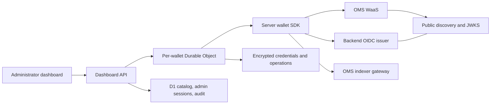

# OMS server wallet dashboard — specification

Status: implemented prototype targeting WaaS v1.1.0, with scope confirmed on 2026-09-16. Deployed to Cloudflare and tested against OMS dev on 2026-09-17 with the whitelisted OIDC audience `api.dev.polygon-dev.technology` and operator-approved all-zero debug PCR0. Live wallet lifecycle, five-chain balances and verified signatures, automatic revocation recovery, and sponsored Polygon preparation pass. Funded transfer execution remains pending. See [acceptance results](LIVE-ACCEPTANCE.md) and [deployment instructions](DEPLOYMENT.md).

## 1. Confirmed requirements

- Demonstrate a custodial dashboard built on OMS wallet infrastructure using a server wallet integration.
- A backend-controlled OIDC identity authenticates to WaaS through an approved issuer/JWKS configuration.
- The backend chooses wallet identifiers and can operate the wallets it creates without end-user approval.
- Include an OIDC auth server, wallet/session persistence, a standalone TypeScript backend SDK, and a dashboard.
- Keep request signing, authentication protocol details, cryptography, and attestation verification inside the SDK.
- The dashboard creates wallets, lists wallets and balances, sends transactions, and signs messages.
- Fetch balances through the OMS indexer gateway.
- Use TypeScript, meaningful automated tests, and a standalone Cloudflare Workers deployment.
- Provide a genuine Node-based local development server that does not require `wrangler dev`, Miniflare, or workerd on NixOS.
- Distribute the standalone SDK to other Node backends as `@polygonlabs/oms-server-wallet-sdk` on npm. The initial release is `0.1.0`; the dashboard consumes the same package through the workspace.

The application operator controls the OIDC issuer and backend credentials and can therefore authorize wallet operations. Wallet signing keys remain within the WaaS architecture. Product copy must describe this division of control accurately.

## 2. Confirmed product decisions

| Decision                 | Requirement                                                       | Implementation                                                                                                                           |
| ------------------------ | ----------------------------------------------------------------- | ---------------------------------------------------------------------------------------------------------------------------------------- |
| Target integration       | WaaS v1.1.0; environment selected through an OMS publishable key. | Derive WaaS/indexer routing and project scope from the key. Deploy the issuer and then register it in OMS dev first.                     |
| Chains and assets        | EVM only: Polygon, Arbitrum, Base, BNB, Ethereum Mainnet.         | Native-token and ERC-20 balances/transfers. Chain IDs 137, 42161, 8453, 56, and 1.                                                       |
| Operations and fees      | Transfers and plain-message signing; gas sponsorship required.    | Require `sponsored: true` from preparation. Do not execute an unsponsored quote. No arbitrary calls, EIP-712, NFTs, Solana, or batching. |
| Dashboard access         | Shared administrator login with one password.                     | Password authentication, server-managed sessions, CSRF protection, and login rate limiting. User management is deferred.                 |
| Identity mapping         | One identity maps to one wallet.                                  | Stable subject per immutable application wallet identifier, with an independently managed credential.                                    |
| SDK boundary             | Independent, standalone server SDK.                               | No embedded SDK dependency; reuse suitable source with attribution and protocol tests.                                                   |
| Auth server scope        | Backend-only JWT issuer.                                          | Internal token minting, public discovery/JWKS; no interactive OAuth flows.                                                               |
| Credential lifecycle     | Automatic reauthentication plus recommended lifecycle controls.   | Automatic expiry recovery, explicit rotation, and disable/re-enable controls. Disabling suppresses automatic reauthentication.           |
| Deployment configuration | Guide the owner when deployment is ready.                         | Configure issuer hostname, signing/encryption secrets, approved PCR0 values, OMS key, and provider registration together at that stage.  |

No secret values are needed to settle these decisions. Nonsecret project identifiers, endpoint URLs, issuer/audience values, and references to the intended secret configuration are sufficient.

## 3. Findings from the integration sources

These observations describe repository snapshots, not a verified deployed environment.

1. **Credential keys are generated by the client.** The backend creates a signing key and signs `CommitVerifier` and `CompleteAuth`. WaaS binds the authenticated identity to that credential and returns credential metadata and associated wallets. The private credential key is not returned by WaaS. [Authentication source][waas-auth]
2. **OIDC uses an ID-token commitment.** The client commits a base64url SHA-256 token hash with issuer, audience, and expiration metadata, then supplies the JWT to complete authentication. WaaS discovers the issuer's JWKS and validates the token. [ID-token handler][waas-idtoken]
3. **Credential nonces require ordering.** Requests use an `OMS-Wallet-Signature` header. The documented nonce rule is strictly increasing per credential; allocating distinct nonces alone does not prevent concurrent requests arriving out of order. [Architecture source][waas-architecture]
4. **Attestation primitives already exist.** The embedded SDK verifies Nitro certificate trust, COSE signatures, PCR0, freshness, request nonce, and request/response binding. Its inspected client wires this verifier into wallet import; the new SDK must explicitly cover its supported wallet RPCs. [Verifier][sdk-attestation], [client integration][sdk-client]
5. **Balance retrieval is an OMS gateway call.** The embedded client uses `GetTokenBalancesDetails`, including native balances, token metadata, network selection, and pagination. [Indexer client][sdk-indexer]
6. **Upstream versions matter.** The inspected WaaS schema defines `/v1/Waas` and already prefers `networkFamily`/`implementation` over the deprecated `type` create-wallet field. Some prose documents retain older paths and wallet-type descriptions. The Go `lib/waas` session helpers also describe an intent-signing protocol; their wire format must not be assumed interchangeable with current request signing. [WaaS schema][waas-schema], [Go session helpers][go-session]

## 4. Architecture

Use a pnpm workspace with React/Vite for the dashboard and Hono for a shared Fetch-based API. Hono supports both [Node][hono-node] and [Workers][hono-workers]. Deploy UI assets, API routes, and issuer routes in one Worker using [Workers static assets][cf-assets], with [D1][cf-d1] for the catalog, sessions, audit events, and operation summaries. A SQLite Durable Object per wallet owns encrypted credentials and authoritative operation state and serializes all upstream calls.

Logical package boundaries:

| Package or directory                   | Responsibility                                                                                          |
| -------------------------------------- | ------------------------------------------------------------------------------------------------------- |
| `apps/dashboard`                       | Wallet list/detail screens, transaction and signing forms, operation history.                           |
| `apps/server`                          | Shared API, dashboard authentication, composition, Worker entrypoint, Node entrypoint.                  |
| `packages/server-wallet-sdk`           | WaaS transport, credentials, OIDC authentication, attestation, wallet/signing/transaction/indexer APIs. |
| `apps/server/issuer.ts`                | Token minting, public discovery/JWKS, signing-key configuration.                                        |
| `apps/server/database.ts`, `worker.ts` | Persistence and coordination interfaces, D1 and local SQLite implementations, migrations.               |
| `tests`                                | Protocol fixtures, API integration, browser workflows, Workers runtime checks.                          |

The SDK must not depend on React, browser storage, Hono, D1 bindings, or application-specific operator login. Inject persistence, request coordination, an ID-token provider, and transport configuration. Test clocks and randomness can be injected through internal seams without exposing unsafe production defaults.

### Runtime parity

- `pnpm dev` starts the Node API and Vite UI with persistent local SQLite storage.
- Local and deployed modes share business logic, validation, encryption, and SDK code.
- Unit/integration tests run in Node without Cloudflare emulation.
- Worker compatibility is checked separately in compatible CI, including crypto and persistence behavior.
- Live local WaaS auth needs a configured public HTTPS issuer/JWKS endpoint. Localhost alone cannot satisfy remote discovery. Document either using the deployed issuer or exposing the local issuer through a stable HTTPS endpoint.
- External WaaS and indexer services remain external dependencies; “standalone” means the application needs no separately hosted application server.

## 5. Identity and credential lifecycle

For each immutable application wallet identifier:

1. Reserve an immutable application wallet identifier in the local registry. Scope uniqueness to the configured OMS project/environment. Display names do not determine identity; a rename UI is outside this prototype.
2. Generate and encrypt a credential signing key in the backend; persist it before using it remotely.
3. Mint a short-lived JWT for the stable subject, with configured `iss`, `aud`, `sub`, `iat`, `exp`, and a unique `jti`/`kid` as appropriate.
4. Complete the signed WaaS OIDC commitment/authentication flow, verifying attested responses before accepting their contents.
5. Discover an existing matching wallet, including pagination, or create the intended wallet and persist its remote ID/address.
6. Use `UseWallet` where necessary to bind a fresh credential to the selected existing wallet.
7. Restore credentials across application restarts. On expiry, authenticate a fresh credential for the same identity and rebind the same wallet.

OIDC signing keys and WaaS credential keys are separate key classes. Store issuer signing keys and the credential-encryption key as runtime secrets. Store encrypted credential material with a random AES-GCM nonce, format/key version, and authenticated context binding it to its project, wallet, and credential record. Do not return private keys or authentication tokens to the dashboard or logs.

Reauthentication must not create a replacement wallet. Local disabling must prevent automatic reauthentication; remote revocation and local disable are distinct operations. The dashboard exposes credential rotation and wallet disable/re-enable controls.

### Concurrency and uncertain outcomes

- Serialize upstream requests per credential, including nonce allocation and dispatch. Parallel operations on independent credentials remain possible.
- Persist nonce progress and credential generations across restarts and Worker instances. A module-local counter or mutex is insufficient for deployment.
- Use one Durable Object per wallet in Workers. The Node adapter uses a per-wallet serial executor and requires a single Node process. Both persist nonce progress before dispatch and use the same SDK. D1 summaries are a display catalog, not the authority for credential or transaction state.
- Persist operation/idempotency records before external mutations. Repeating an idempotency key with different input is a conflict.
- Treat create/execute timeouts as uncertain outcomes. Reconcile with WaaS before creating or submitting again. Do not assume wallet `reference` is a server-enforced uniqueness key without verifying the selected version.
- A transaction already submitted upstream may succeed even if response attestation or transport subsequently fails; record that uncertainty and reconcile without automatic duplicate submission.

## 6. OIDC issuer

The issuer is dedicated to backend identity assertions accepted by WaaS.

- Public `/.well-known/openid-configuration` and a JWKS endpoint with public keys only.
- JWT issuance through an internal service API only; no HTTP token endpoint is exposed.
- Fixed configured issuer/audience and signing algorithm; stable `kid`; short token lifetime; no anonymous subject-to-token endpoint.
- Metadata advertises only implemented capabilities. Interactive authorization-code/login/logout flows are excluded unless requested.
- Document provider registration in OMS, the exact public URLs, and how to verify registration.
- Support deliberate signing-key rotation with overlapping public keys for the applicable token and upstream cache lifetimes.

## 7. SDK responsibilities

The SDK offers wallet create/restore, credential lifecycle, balance reads, plain-message signing, sponsored transfer preparation/submission/status, and typed errors. ERC-20 calldata encoding stays inside the SDK; arbitrary calls are not exposed.

- Use the selected WaaS schema for typed RPC contracts, exact serialization, and endpoint paths.
- Implement credential signing with a Workers/Node-compatible algorithm supported by the target WaaS. The implementation uses P-256/Web Crypto.
- Handle OIDC token commitments, credential lifetimes, wallet discovery/binding, and expiry recovery.
- Verify supported WaaS response attestations against configured trusted measurements and the Nitro root. Check certificate chain/constraints, signature, timestamp, nonce, and exact request/response body binding.
- Obtain trusted PCRs from an approved release/configuration source. A server-reported PCR is not itself authorization to trust that image.
- Make test/development attestation policies explicit. Never silently relax a deployed policy after verification fails.
- Keep raw response bytes available until verification finishes, with bounded response sizes.
- Handle indexer pagination, metadata, partial failures, and arbitrary-precision amounts. Represent base-unit amounts as decimal strings at API/database boundaries.
- Provide bounded request timeouts with abort signals and structured errors distinguishing validation, auth, attestation, upstream availability, and unknown submission state.
- Restrict automatic retries to cases with established safe semantics. Transaction completion polling must be resumable rather than keeping a Worker request alive indefinitely.

## 8. Dashboard and application API

Required screens:

- **Wallet list:** searchable identifier/name/address, network filter, balances, credential health, last refresh, and create action. Paginate registry reads and load balances with bounded fan-out.
- **Create wallet:** application identifier and display name; wallet family/implementation only when supported by the chosen scope. Reusing an identifier returns its registered wallet or a clear conflict, never silently creates another.
- **Wallet detail:** copyable address, balance table with network/asset/amount, refresh, session expiry, and operation history.
- **Send:** network, recipient, asset, and exact amount; prepare a transaction and show fees before confirmation. Bind the confirmed quote to its wallet, chain, and payload; expired/changed quotes require preparation again.
- **Sign:** plain-text message input; display the payload and return a copyable signature. Verify signatures with wallet-aware verification rather than assuming every signature is a simple EOA signature.
- **Activity:** show submitted operations and their pending/success/failure/unknown states, with transaction hashes and explorer links where available. This is application operation history; full historical on-chain activity is a separate scope choice.

The browser calls the application API. Validate operator authorization, wallet selection, networks, addresses, amounts, and payload sizes on the server. Cookie-based operator authentication requires CSRF protection and secure cookie settings. Authentication secrets never enter the frontend bundle.

Show indexer errors and stale timestamps separately from zero balances. Distinguish simulated test fixtures from live data if a demo fixture mode is added.

## 9. Persistence and configuration

Logical entities:

| Entity           | Main data                                                                                                                                                               |
| ---------------- | ----------------------------------------------------------------------------------------------------------------------------------------------------------------------- |
| Wallet           | Local ID, immutable application identifier, display name, project/environment, subject, remote wallet ID, address, family/implementation, lifecycle status, timestamps. |
| Credential       | Owner identity/wallet, public credential ID, encrypted private material, algorithm, generation, nonce state, expiry, status, encryption-key version.                    |
| Operation        | Wallet/operator, kind, idempotency key, normalized input hash, quote/remote transaction ID, status, chain/hash, sanitized failure, timestamps.                          |
| Audit event      | Operator, action, wallet/operation references, outcome, timestamp; no private keys, tokens, or raw sensitive request logs.                                              |
| Operator session | Fields required by the chosen dashboard authentication method.                                                                                                          |

Keep migrations shared where possible; test persistence contracts against both adapters. Use database uniqueness constraints, not only application checks, for identifier/idempotency uniqueness. Session and nonce coordination reads must observe authoritative state.

Document nonsecret configuration for environment/endpoints, OMS project/key routing, issuer/audience, networks, attestation pins, local database location, and fee behavior. Document runtime secrets for issuer signing, credential encryption, and operator/machine authentication. Provide an example configuration containing placeholders only.

## 10. Verification and acceptance

| Area                   | Required evidence                                                                                                                                                                                        |
| ---------------------- | -------------------------------------------------------------------------------------------------------------------------------------------------------------------------------------------------------- |
| Request signing        | Independent known-answer/verification fixtures for the actual selected WaaS protocol; malformed payload and replay cases.                                                                                |
| OIDC                   | Correct discovery/JWKS and JWT claims; wrong issuer/audience/key, expiry, commitment mismatch/reuse, and key rotation cases.                                                                             |
| Attestation            | A trusted signed fixture or controlled cryptographic fixture harness; reject tampered signatures/bodies, wrong PCR/root/nonce, invalid certificate constraints, stale timestamps, and missing documents. |
| Credential persistence | Restart restores access; expiry restores the same wallet; encrypted records cannot be swapped; disabled wallets cannot silently reauthenticate.                                                          |
| Concurrency            | Concurrent Worker requests cannot reuse/out-of-order a credential nonce; ownership loss and restart are covered.                                                                                         |
| Mutation recovery      | Duplicate API requests, upstream timeouts, and failures between remote success and local persistence do not cause blind duplicate creation/submission.                                                   |
| Balances               | Native/token amounts, decimals, large integers, pagination, metadata gaps, gateway errors, and stale UI state.                                                                                           |
| Dashboard              | Browser workflows for create, list/detail, send/confirm/status, signing, authorization failure, and upstream errors.                                                                                     |
| Runtime                | Node development works on this NixOS machine; Worker bundle and crypto/storage behavior pass in compatible CI.                                                                                           |
| Live integration       | Configured OIDC auth, create/restore, balances, signing verification, and one agreed test transaction against the chosen environment.                                                                    |

Use Vitest for unit and service integration tests, Playwright for critical dashboard flows, and the documented manual live acceptance run with explicit configuration. Offline tests must not submit live transactions. Pin dependencies, run typecheck/lint/tests/build in CI, and publish coverage reports focused on the crypto, auth, persistence, and transaction failure paths.

Completion means the agreed workflows operate against real OMS services, survive a server restart, and can be deployed using documented Workers configuration, migrations, and secret setup. Passing fixture tests alone does not establish live WaaS compatibility.

## 11. Implementation sequence

1. Pin WaaS v1.1.0; prove Worker compatibility for crypto, attestation, persistence, and coordination.
2. Implement the workspace, shared Node/Worker server, migrations, OIDC issuer, and credential encryption.
3. Implement the SDK authentication/create/restore/signing path with protocol and negative tests; validate against the target environment.
4. Add indexer reads and transaction prepare/execute/reconciliation, including idempotency and concurrency tests.
5. Build the dashboard and operator authentication; cover the complete browser workflows.
6. Finish deployment configuration, CI, operational documentation, and the live acceptance run.

## Source snapshots

Research performed on 2026-09-16. Compatibility with the actual deployed environment remains subject to live acceptance. The v1.1.0 release schema was checked separately from these development-branch snapshots.

- WaaS: `6491d235805bb1df05b8e765918dfc75fe36208a`.
- Embedded SDK: `6fb0b316d82db655a1ef6063027d53c6a383e9f3`.
- Go Sequence: `fc68b61cde00ac4d98f589b41a65f47d4f143bfd`.

[waas-auth]: https://github.com/0xsequence/waas/blob/6491d235805bb1df05b8e765918dfc75fe36208a/docs/authentication.md
[waas-idtoken]: https://github.com/0xsequence/waas/blob/6491d235805bb1df05b8e765918dfc75fe36208a/auth/idtoken/auth_handler.go
[waas-architecture]: https://github.com/0xsequence/waas/blob/6491d235805bb1df05b8e765918dfc75fe36208a/docs/architecture.md
[waas-schema]: https://github.com/0xsequence/waas/blob/v1.1.0/proto/schema/waas.ridl
[sdk-attestation]: https://github.com/0xPolygon/oms-wallet-typescript-sdk/blob/6fb0b316d82db655a1ef6063027d53c6a383e9f3/packages/oms-wallet/src/attestation.ts
[sdk-client]: https://github.com/0xPolygon/oms-wallet-typescript-sdk/blob/6fb0b316d82db655a1ef6063027d53c6a383e9f3/packages/oms-wallet/src/clients/walletClient.ts
[sdk-indexer]: https://github.com/0xPolygon/oms-wallet-typescript-sdk/blob/6fb0b316d82db655a1ef6063027d53c6a383e9f3/packages/oms-wallet/src/clients/indexerClient.ts
[go-session]: https://github.com/0xsequence/go-sequence/blob/fc68b61cde00ac4d98f589b41a65f47d4f143bfd/lib/waas/session.go
[hono-node]: https://hono.dev/docs/getting-started/nodejs
[hono-workers]: https://hono.dev/docs/getting-started/cloudflare-workers
[cf-assets]: https://developers.cloudflare.com/workers/static-assets/
[cf-d1]: https://developers.cloudflare.com/d1/
