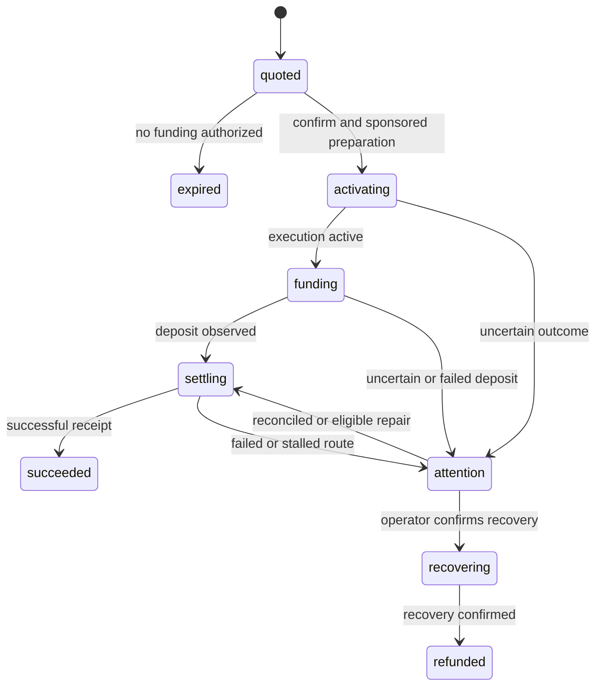

# Trails swaps — implementation specification

Status: finalized implementation plan, 2026-09-17. Implementation and live acceptance are pending. This extends [the prototype specification](SPEC.md); existing wallet, OIDC, sponsorship, attestation, and Node development requirements continue to apply.

## 1. Product contract

An administrator can exchange a specified amount of an asset in a managed wallet for another asset, on the same chain or another supported chain. The destination and every recovery recipient are always that managed wallet. One confirmation authorizes the reviewed swap and its funding transfer; recovery requires a separate confirmation.

| Decision    | Initial implementation                                                                                                                                                                               |
| ----------- | ---------------------------------------------------------------------------------------------------------------------------------------------------------------------------------------------------- |
| Chains      | Ethereum (1), Polygon (137), Arbitrum (42161), Base (8453), BNB Chain (56), intersected with Trails discovery and available routes.                                                                  |
| Trade       | Exact input; same-chain swaps, cross-chain swaps, and same-asset bridges. Reject a same-chain/same-token no-op.                                                                                      |
| Assets      | Native assets and a curated registry of USDC/USDT contracts where supported. Resolve decimals per contract; never equate assets by symbol. Expand the registry in later PRs.                         |
| Recipient   | Managed wallet address on the destination chain. The browser cannot override owner, recipient, or refund address.                                                                                    |
| Routing     | Trails automatic routing. Show the selected providers; no provider selection UI initially.                                                                                                           |
| Slippage    | Default 50 basis points (0.5%); selectable 10, 50, or 100 basis points. Enforce the same bounds on the server. Send a decimal fraction to Trails (`50 / 10000`).                                     |
| Fees        | OMS sponsors funding and recovery wallet transactions. Trails execution, bridge, and protocol charges are included in the quote and borne by swap funds. No application fee or all-cost sponsorship. |
| Runtime     | Independent TypeScript backend SDK; one Cloudflare Worker with existing D1 and per-wallet Durable Objects; Node + SQLite development without `wrangler dev`.                                         |
| Credentials | Separate backend-only Trails key. Existing OMS key, issuer, audience and attestation policy remain in use.                                                                                           |

Exclude external recipients, exact output, arbitrary token-address entry, permit-based funding, arbitrary destination calls, DeFi actions, recurring swaps, batch swaps, non-EVM chains, fiat and new administrator roles. Typed-data signing and restricted contract execution are added internally for recovery, not as new arbitrary-call dashboard endpoints.

## 2. Source baseline and resolved protocol decisions

Research uses immutable snapshots of the repositories supplied by the owner:

- Trails SDK: `5f7be3922ac85cb37113185daa9f81cd2e52ac58`.
- Trails API: `352bcb89c20a7c8111062d38a3d0cc603c65f860`.
- WaaS: existing v1.1.0 integration, with deployed OMS dev compatibility checked during acceptance.

These snapshots establish implementation behavior; they do not prove that a particular API deployment is running those commits.

### No CommitIntent

**Do not call `CommitIntent`.** `QuoteIntent` persists the intent as `QUOTED`; `ExecuteIntent` accepts that state. The API explicitly deprecates commit for new clients. The current SDK send handler ignores its legacy commit callback and starts execution before the standard wallet deposit. [Quote persistence][api-quote], [commit deprecation][api-commit], [execution gates][api-execute], [SDK send handler][sdk-handler]

Use **balance-monitored execution**: after local confirmation and sponsored funding preparation, call `ExecuteIntent({ intentId })`, then fund the intent once execution is confirmed active. With neither a deposit hash nor permit signature, the v1.5 API creates a deposit leg monitored by balance preconditions. The SDK uses this ordering. No second execute request is needed after a normal successful deposit. [Execution builder][api-build-execution], [deposit worker][api-deposit-worker]

Two source details affect recovery and retries:

- Execute on an already advanced intent returns a status error rather than a universally successful idempotent response. Reconcile with `GetIntent`/`GetIntentReceipt`; do not classify every status error as success. [Execution handler][api-execute]
- An expired, unfunded `QUOTED` intent is rejected. An already funded intent with a deposit hash can pass the expiry gate. This is a reconciliation mechanism, not permission to fund an expired quote. Direct client hashes without visible receipts can mark an intent invalid, so any repair using a hash must wait for confirmed on-chain evidence. [Expiry behavior][api-execute], [deposit validation][api-validate-deposit]

### Explicit protocol and amount encoding

Request `options.intentProtocol: "v1.5"`; check `GetSupportedIntentProtocols` at readiness and fail closed if it is unavailable. Do not silently follow a changed default or downgrade to v1. Retain the protocol and returned contract context with each operation. [Protocol selection][api-protocol]

Use decimal strings for all base-unit amounts over our HTTP API, storage and Trails JSON. Use `bigint` for arithmetic. The generated Trails client serializes bigint values to decimal strings; OpenAPI's numeric annotations are insufficient guidance for JavaScript amounts. Reject unsafe numeric amounts returned by upstream rather than rounding them. Fee USD estimates can be decimal display values and must never determine the amount sent. [Wire codec][sdk-generated], [request and deposit types][api-types]

Honor the returned `expiresAt`; do not hard-code the older guide's five-minute quote or ten-minute commit windows. The inspected API currently issues a 15-minute intent expiry, while underlying provider quotes can expire sooner. Expiry and minimum-output validation remain necessary even when activation succeeds. [Quote expiry][api-quote]

### Recovery signatures

`PrepareIntentRecovery` returns a canonical `v3_calls_payload` envelope, EIP-712 typed data, chain, intent address, token balances and payload hash. `BuildIntentRecoveryTransaction` accepts that payload and the owner's signature and constructs the recovery call, including deployment of the **Trails intent wallet** when necessary. [Recovery API][api-recovery]

The builder uses ERC-1271 for an owner with deployed contract code. An owner without code is treated as an EOA and must supply a 65-byte EOA signature. WaaS wraps an undeployed smart-wallet signature in EIP-6492. Therefore an undeployed **OMS owner wallet** on the recovery chain must be deployed before calling the recovery builder; do not assume the builder's `requiresDeploy` handles this owner deployment. [Recovery signature branch][api-recovery], [WaaS typed-data signing][waas-sign], [WaaS deployment bundling][waas-relayer]

## 3. Standalone SDK boundaries

Add a `./trails` export to `@polygonlabs/oms-server-wallet-sdk` containing:

- `TrailsClient`: a small Fetch-based client with runtime response validation, bounded body size, deadlines, structured errors and separate access-key handling. Use direct RPC calls; do not import Trails React hooks or the embedded OMS SDK.
- `WalletSwaps`: quote validation, funding construction, operation state transitions, upstream reconciliation, and recovery validation. Supply wallet/store/clock/transport dependencies through interfaces.
- A durable swap store contract with atomic updates for operation revision, pending action, reservation and next reconciliation time. Supply in-memory test and SQLite-backed application adapters; the SDK must not import Cloudflare or application modules.
- A chain-read interface for receipts, native/ERC-20 balances and code checks. Use configured EVM RPC endpoints; OMS indexer remains the dashboard balance source. Do not rely on stale indexer balances to authorize a debit.

Proposed public operations:

```ts
quoteSwap(operationId, request): Promise<SwapQuote>
confirmSwap(operationId, quoteRevision): Promise<SwapOperation>
getSwap(operationId): Promise<SwapOperation>
reconcileSwap(operationId): Promise<SwapOperation>
prepareRecovery(operationId, recoveryId, target): Promise<RecoveryQuote>
confirmRecovery(operationId, recoveryId, revision): Promise<SwapOperation>
```

`SwapRequest` contains origin/destination chain and asset, positive base-unit input amount, and slippage basis points. The SDK binds the owner/recipient from its wallet. Confirm methods authorize persisted work and return promptly; host schedulers drive bounded reconciliation steps. Separate `quoteSwap` retries from an explicit new quote revision so a retried request cannot replace an approved quote.

Extend wallet internals for attested `SignTypedData` and verification, and preparation of validated recovery/deployment transactions through WaaS `PrepareEthereumTransaction` in `relayer` mode. Retain the `sponsored: true` requirement and existing unknown-submission handling. Normal swap funding continues to use `prepareTransfer`/`executeTransfer`.

Use a pinned, Workers-compatible Sequence payload codec for recovery decoding and hash verification (the SDK uses `@0xsequence/wallet-primitives`). Check its bundle/runtime behavior in PR 1. Keep any adapted source attribution. Separate workflow serialization from the existing credential nonce executor; never acquire the same non-reentrant executor recursively or hold it while waiting for settlement.

Trails responses are authenticated HTTPS API responses, not Nitro-attested responses. Existing WaaS calls continue to require attestation. Do not describe swap-provider results as attested.

## 4. RPC contract

Base URL: `https://trails-api.sequence.app`; all calls are JSON `POST /rpc/Trails/<Method>` with `X-Access-Key`. Keep endpoint configuration server-controlled. Send the configured `APP_ORIGIN` when an Origin header is needed; never derive upstream Origin from untrusted incoming headers. [Trails client configuration][sdk-client]

| Method                                                                            | Application use                                                                                                                                 |
| --------------------------------------------------------------------------------- | ----------------------------------------------------------------------------------------------------------------------------------------------- |
| `GetChains`, `GetTokenList`, `GetExactInputRoutes`                                | Cache discovery, intersect it with application chain/token policy, and filter selectors. A fresh quote is authoritative for route availability. |
| `GetSupportedIntentProtocols`, `GetDefaultIntentProtocol`, `GetProtocolContracts` | Readiness diagnostics and validation of supported v1.5 contract context.                                                                        |
| `QuoteIntent`                                                                     | Create a quote; persist the full result server-side and expose a sanitized review model.                                                        |
| `ExecuteIntent`                                                                   | Start balance monitoring after confirmation, before funding.                                                                                    |
| `GetIntent`, `GetIntentReceipt`                                                   | Authoritative upstream status and settlement reconciliation. A missing receipt before execution is not a failed swap.                           |
| `GetIntentHistory`                                                                | Inspect recoverable intent balances when needed, filtered to the managed owner and known operation.                                             |
| `RetryIntent`                                                                     | Explicit repair of an eligible failed deposit leg using the existing, confirmed funding hash; never a generic retry or new transfer.            |
| `PrepareIntentRecovery`, `BuildIntentRecoveryTransaction`                         | Prepare and build restricted owner-authorized recovery.                                                                                         |

Use short polling for our runtime. `WaitIntentReceipt` is optional for a standalone consumer, not a long-lived Worker request; its `done` flag indicates completion, not success. `GetIntentReceipt` can return NotFound before a receipt exists, whereas `WaitIntentReceipt` may synthesize a pending receipt. [Receipt implementation][api-receipts], [RPC schema][api-schema]

Example quote body (addresses shown only to illustrate the contract; registry metadata supplies them):

```json
{
  "ownerAddress": "<managed-wallet-address>",
  "originChainId": 137,
  "originTokenAddress": "0x3c499c542cEF5E3811e1192ce70d8cC03d5c3359",
  "originTokenAmount": "10000000",
  "destinationChainId": 8453,
  "destinationTokenAddress": "0x833589fCD6eDb6E08f4c7C32D4f71b54bdA02913",
  "destinationToAddress": "<same-managed-wallet-address>",
  "tradeType": "EXACT_INPUT",
  "fundMethod": "WALLET",
  "mode": "SWAP",
  "onlyNativeGasFee": true,
  "options": {
    "intentProtocol": "v1.5",
    "slippageTolerance": 0.005
  }
}
```

`onlyNativeGasFee` matches Trails' smart-wallet quoting path; it does not require the owner to pay native funding gas when OMS sponsorship is available. Omit destination calldata, approval address, contract overrides, settlement and permit fields. Normalize native assets to the accepted native token address at this boundary. [SDK quote construction][sdk-quote], [request types][api-types]

## 5. Quote, authorization and execution

1. Validate the wallet is enabled, chains/assets are supported, amount and precision are valid, and there is no conflicting source-chain debit. Fetch the quote with explicit protocol and exact-input mode.
2. Validate response identity, owner, recipient, chain IDs, assets, protocol, expiry, positive output/minimum output, deposit amount and precondition. The wallet debit must not exceed the input budget. For the initial exact-input contract require the deposit amount to equal the requested amount; a differing amount is an unsupported quote, not a silent adjustment.
3. Reconstruct funding locally from `depositTransaction.toAddress`, `tokenAddress`, `amount` and `chainId`; compare it with returned `to/data/value`. Accept only an exact native transfer or ERC-20 `transfer`. Require the recipient to equal the origin intent address. Never execute arbitrary returned funding calldata.
4. Persist a revisioned quote with a digest over all reviewed and executable fields. Display expected output (`toAmount`), minimum output (`toAmountMin`), provider route, fees, price impact, estimated duration and returned expiry. Invalidate confirmation on any form change. Do not fabricate missing estimates.
5. On confirmation, recheck enabled state, quote revision, available on-chain funds and expiration. Reserve the exact source debit. Prepare the OMS transfer and require sponsorship before activating Trails. Enforce at least 30 seconds remaining on both quotes before starting a new funding submission; if this cannot be met, require a fresh review. Never refresh a quote and execute it without confirmation.
6. Persist `activating` and its outbox action, then call `ExecuteIntent({ intentId })`. On a lost response, query the same intent. Proceed only after confirming that it is executing and its funding leg can still accept funds. If it remains quoted and unexpired, a bounded activation retry may use the same ID.
7. Persist `funding` and the WaaS operation/quote identifiers **before** calling WaaS Execute. Submit only that prepared transfer. Persist every returned hash/status. An uncertain response triggers reconciliation of the same WaaS transaction, never another preparation or deposit.
8. Poll both systems as necessary. Once funded, continue tracking even after quote expiry, logout, a restart, or a disabled swap feature. Do not call Execute again in the normal balance-monitored path. Keep the independently observed funding hash because Trails can represent this leg with a sentinel hash.
9. Mark success only from a successful Trails receipt and retain destination transaction/output evidence. Refresh OMS balances; show indexer lag separately. Inspect residual intent balances on failure/refund and when recovery is requested, including after apparent success.

If activation succeeds but no funding was submitted before expiry, abandon local funding and preserve the upstream intent record. If a funding attempt may have happened, resolve it before allowing another swap of those funds. If a delayed confirmed deposit arrives after Trails' deposit wait has failed, inspect eligibility for `RetryIntent` with that same confirmed hash; otherwise recover the existing funds. Do not create a replacement intent or automatically add funds to cover a shortfall.

## 6. Persistent state and recovery rules

Keep local workflow phase separate from upstream intent status and per-chain transaction status:



The diagram summarizes the main paths. Automatic refunds can move a funded operation to `refunded`; definitive no-debit errors can become `failed`. An armed but unfunded operation can expire locally without changing upstream state. `attention` is not evidence that funds are lost or available to spend. `SUCCEEDED`, `FAILED`, `REFUNDED`, `ABORTED`, and `INVALID` must remain distinct in stored upstream data. Never infer a full refund solely from `FAILED` or infer settlement from a funding hash.

Persist operation ID, wallet/environment scope, request hash, quote revision and full intent snapshot, approved budget/minimum output, protocol/contracts, phase, upstream states, funding and recovery child operation IDs, transaction evidence, asset reservation, last error, attempt counters, revision, and next action time. Store raw signatures and canonical recovery payloads only in encrypted authoritative storage; return sanitized UI models.

All mutations are idempotent by wallet + operation ID + input digest. A duplicate ID with different input returns 409. Serialize confirmation, funding and recovery transitions per wallet. For the prototype, block additional outgoing transfers/swaps on the source chain while a funding debit is submitting or uncertain; release that guard only after on-chain reconciliation and a fresh balance read. Quotes do not reserve funds. Ordinary transfers must honor this guard, and swap confirmation must check unresolved existing transfers.

Use the existing Durable Object as authoritative owner of workflow state and the action outbox. Atomically persist the next action with each transition, and schedule a wake-up before issuing remote mutations. One alarm processes a bounded set of due steps and schedules the earliest remaining action. Explicitly reschedule on upstream failures; do not depend only on Cloudflare's finite automatic retries. No sleeping or minutes-long receipt loops inside an HTTP request. [Durable Object alarms][cf-alarms]

Use the same state machine in Node, with a persistent SQLite due-work table and a bounded runner that scans on startup. Preserve the single-process local constraint. Separate workflow locking from nonce allocation, but coordinate all wallet debits. Duplicate alarms, concurrent browser requests and restart recovery must be safe.

Extend D1/SQLite with a versioned swap summary projection indexed by wallet, update time and active state, plus recovery activity. Projection failures must be retried from the authoritative outbox and must not roll back or repeat a wallet submission. Do not put authoritative operation state only in D1 summaries. Add an ordered migration runner for Node (currently it only installs migration 0001); test upgrades of existing databases and Durable Object storage.

Disabling a wallet blocks new funding, signing, activation and recovery authorization. Continue read-only observation through Trails and chain RPCs. Do not bypass disabled-wallet rules to reauthenticate for a WaaS status query; if no public transaction evidence resolves an unknown submission, retain it until re-enable permits reconciliation. Trails may continue executing an already funded intent. Re-enable and reconcile before resuming an explicitly authorized unsent action; expired approvals need review again.

## 7. Recovery implementation

Recovery is a required release path, including source and destination intent addresses and intermediate assets. A failed swap can return a different token or return funds on the destination chain; show actual asset, amount and chain rather than promising restoration of the original input.

1. Reconcile current upstream state and inspect recoverable balances for both recorded intent addresses. Offer recovery only when there is a positive balance and no active local recovery. Do not expose an unconditional cancel button or race an ordinary progressing route automatically. Manual recovery of a stalled route requires an explicit review and a fresh status check.
2. Call `PrepareIntentRecovery` with the recorded intent ID/address and managed wallet as `refundToAddress`. Retain the returned canonical envelope unchanged.
3. Decode the envelope and cross-check typed data and `payloadHash`. Require Sequence Wallet v3 `Calls`, the matching chain and intent verifying contract, and calls that only sweep/transfer intent-owned assets to the managed wallet. Validate sweep utility against the stored, supported Trails contract context. Reject unexpected delegates, approvals, destinations, or unrelated calls; bound payload and array sizes.
4. Check whether the OMS owner is deployed on this recovery chain. If not, prepare a narrowly scoped, sponsored zero-value self-call through WaaS to deploy it, show that step in the recovery review, execute it idempotently, wait for success and confirm code exists. This uses WaaS deploy-and-call behavior, but the exact sponsored self-call must pass live acceptance. Do not change public positive-amount transfer validation to expose arbitrary zero-value calls.
5. Recheck balance/state after deployment. If reviewed assets or authorization materially change, prepare a new review. Use WaaS `SignTypedData` and `IsValidTypedDataSignature` for the validated payload. Pass the deployed-wallet signature intact; do not truncate it or unwrap EIP-6492 by guesswork.
6. Call `BuildIntentRecoveryTransaction`, then verify chain, intent, payload hash, zero native value and returned execution/deployment envelope against the signed payload and supported contract context. Its `requiresDeploy` refers to the Trails intent wallet. Do not use the returned transaction as a generic calldata escape hatch.
7. Prepare the recovery call with WaaS, require sponsorship, persist submission state and execute once. Reconcile uncertain submissions through the existing WaaS transaction ID. Confirm recovered transfers/balances and retain actual results even if Trails' status projection lags.

The live gate must demonstrate both deployed-owner recovery and destination recovery when the owner starts undeployed. If deployment or signature compatibility is unavailable in the target environment, report the precise upstream limitation and keep affected swap execution disabled until there is a tested recovery path. Do not silently downgrade to EOA signing or unsponsored transactions.

## 8. Application API and dashboard

All routes retain shared-admin session checks, CSRF/origin validation, bounded request bodies and wallet scope checks. Rate-limit quote creation independently from execution and debounce UI quote requests. The client sends asset choices and IDs, never an upstream intent object, destination calldata or typed data.

| Route                                                            | Contract                                                                                   |
| ---------------------------------------------------------------- | ------------------------------------------------------------------------------------------ |
| `GET /api/swaps/config`                                          | Enabled/readiness state, allowed chains/assets/slippage, sanitized fee policy. No keys.    |
| `POST /api/wallets/:id/swaps`                                    | Create or return a quote using a client-generated operation ID and normalized request.     |
| `POST /api/wallets/:id/swaps/:swap/confirm`                      | Confirm persisted quote revision; return 202 and current operation.                        |
| `GET /api/wallets/:id/swaps`                                     | Paginated local swap history.                                                              |
| `GET /api/wallets/:id/swaps/:swap`                               | Current authoritative operation with projection freshness.                                 |
| `POST /api/wallets/:id/swaps/:swap/reconcile`                    | Request a bounded reconciliation; never create another deposit.                            |
| `POST /api/wallets/:id/swaps/:swap/recoveries`                   | Prepare a review for a known recoverable intent side, with a client-generated recovery ID. |
| `POST /api/wallets/:id/swaps/:swap/recoveries/:recovery/confirm` | Authorize the reviewed recovery and any disclosed owner-deployment step; return 202.       |

Add `/wallets/:id/swap` and `/wallets/:id/swaps/:swap` routes to the existing History API navigation. Back/Forward, refresh, direct links and post-login return must work. Leaving a page never cancels submitted work.

The form shows indexed holdings for source selection, supported destination assets, precise amounts and available balance. Quote review shows amount spent, expected/minimum received, fee breakdown, route, price impact and expiry. Show funding gas as sponsored separately from Trails costs; do not double-count aggregate and component fees. Requote on expiry or edited inputs and disable confirmation until reviewed.

Progress distinguishes preparing, funding, swapping/bridging, completing, refunding and needs attention. Show chain-specific hashes and a Trails intent link where available. Preserve hashes from both systems; never display a zero/sentinel hash as an explorer link. Activity shows swaps and their child recovery steps without presenting a funding transfer as a second independent spend.

Keep existing aggregated USD balances based on OMS indexed wallet holdings. Show active swap amounts separately as in transit; do not add quoted destination value to wallet totals. If the indexer is stale, label it and avoid computing spendable funds or an exact portfolio total from inconsistent observations.

## 9. Configuration and rollout

Add `TRAILS_API_KEY` as a Worker secret and ignored local environment value, `TRAILS_API_URL` (default above), and `SWAPS_ENABLED` (default false). Keep the accepted protocol fixed to v1.5 for this release. Add server-side EVM RPC configuration for receipt/code/balance validation, reusing OMS-compatible gateways where available. Do not assume a Trails key grants OMS access or that OMS dev selects a Trails testnet.

Expose swap-specific readiness without breaking existing transfers or login when the Trails key is absent. Bind persisted work to the Trails endpoint and project identity so an endpoint/project change cannot replay an operation elsewhere; key rotation within the same project must remain possible. Never derive scope from a raw secret value. Drain or explicitly reconcile pending work before changing environments.

`SWAPS_ENABLED=false` prevents new quotes/confirmations while allowing existing tracking and explicitly authorized recovery. Deploy additive schemas and code with execution disabled, configure the separate key, verify readiness/contract compatibility, then complete funded acceptance before enabling. Retain background reconciliation during rollback of the UI; do not roll back below a schema version needed to track funded work.

Logs contain wallet/operation/intent IDs, phase, chain and sanitized errors. Exclude keys, OIDC tokens, credentials, signatures, canonical signed payloads and full upstream request/response bodies. Record quote, confirmation, activation, funding, repair and recovery events for diagnosis.

## 10. Test and acceptance contract

| Layer           | Required evidence                                                                                                                                                                                                                                                                         |
| --------------- | ----------------------------------------------------------------------------------------------------------------------------------------------------------------------------------------------------------------------------------------------------------------------------------------- |
| RPC/codec       | Source-derived v1.5 fixtures; separate key/header routing; decimal strings beyond JS safe integers; optional/null fields; HTTP/RPC errors; timeouts, redirects and malformed responses.                                                                                                   |
| Quotes          | Supported chains/assets, decimals, native normalization, explicit exact input, 50-bps conversion, budget/minimum output binding, recipient tampering, mismatched calldata, expiry, stale revisions, missing metadata and unavailable routes.                                              |
| Orchestration   | No `CommitIntent`; Execute-before-funding; execute response lost after success; status error reconciliation; duplicate confirmation; outbox recovery at every remote/local boundary; no duplicate deposit.                                                                                |
| Funding         | Sponsored native/ERC-20 transfers; unsponsored rejection; stale balances and concurrent ordinary transfers; funding submitted after disconnect; confirmed, failed and uncertain WaaS outcomes; expired funding approvals.                                                                 |
| Settlement      | Source and destination hashes, missing receipts, balance-monitor sentinel, slow bridges, delayed deposit repair, automatic refunds, invalid/aborted intents and indexer lag. No false success from a submitted hash.                                                                      |
| Recovery        | Canonical payload/hash checks, recipient/chain/contract tampering, multi-token/intermediate-asset balances, deployed ERC-1271 owner, undeployed owner deployment, separate intent deployment, unsponsored rejection, concurrent recovery, unknown submission and actual received amounts. |
| Credentials     | Renewal during long-running work, revocation recovery, disabled wallets, independent confirmation/signing versus read-only monitoring.                                                                                                                                                    |
| Runtime/storage | Node and Worker adapters, existing database migration, restart at each phase, DO eviction/alarm redelivery, many operations sharing one alarm, alarm rearming after prolonged outages, D1 projection failure.                                                                             |
| Browser         | Quote/confirm/progress/history/recovery, stale quote and route failure, double click, reload/Back/Forward/direct link, session expiry and same-wallet destination.                                                                                                                        |

Run existing `pnpm check`, coverage, Workers tests, Worker bundle validation and browser suites for implementation PRs, with focused new tests in the corresponding PR. Normal tests remain offline and cannot move funds. Documentation-only changes need formatting/link/diff checks, not live tests.

Live acceptance uses separately configured Trails credentials and an agreed small funded wallet/budget. Record actual service versions and redact credentials. Verify discovery/quotes and OMS funding sponsorship across all five chains; execute a representative same-chain native-to-token swap, cross-chain stablecoin swap, and same-asset bridge (including Polygon/Base and an additional chain where funded). Test a missing native-gas balance with ERC-20 input. Exercise source recovery and destination recovery with an initially undeployed owner through a controlled scenario. Do not manufacture failures with arbitrary mainnet calls. If a recovery scenario needs upstream test tooling, record that dependency and keep release acceptance incomplete until demonstrated.

## 11. Implementation PRs and completion

Implementation resumed on 2026-09-17 after the standalone SDK was published as `@polygonlabs/oms-server-wallet-sdk`. The first implementation branch adds the optional `/trails` API client, quote/recovery validators and attested typed-data signing. It does not enable dashboard swaps or submit funding/recovery transactions.

Live compatibility findings for PR 1:

- The API advertises `v1.5` on the wire. The RIDL enum member is named `v1_5`; requests must use its serialized `v1.5` value.
- `GetProtocolContracts` returns capitalized `TrailsContracts`. For v1.5, the three legacy entrypoint/router fields are empty; `trailsUtilsAddress` is populated.
- Quotes can return `passthrough: null`, an empty `destinationApproveAddress`, and omit the `onlyNativeGasFee` hint from the stored request. These shapes are accepted without weakening owner, transfer, amount, slippage or destination-call checks.
- The pinned TS payload encoder emits a byte for a zero nonce and an explicit empty calldata length. The Go recovery encoder omits both. Regression vectors independently assemble Go bytes; validation accepts the Go and pinned TS representations and rejects trailing data.
- Readiness and quote checks do not satisfy the funded execution/recovery release gates below. In particular, WaaS verification of EIP-6492 signatures does not prove that Trails accepts them for recovery.

PR 1 live checks on 2026-09-17 passed discovery for all five chains (405 listed tokens), a 10 USDC Polygon → Base quote, and a 100 POL → USDC Polygon quote. Dev WaaS signed and verified inert typed-data probes on Polygon and Base; both used EIP-6492 wrappers. Test credentials were revoked afterward. No intent was activated or funded, and no recovery authorization was signed.

`GetExactInputRoutes` returned an empty destination list for Polygon native USDC with the configured key, although `QuoteIntent` accepted that source for the Base route. Resolve that discovery discrepancy before implementing dashboard route filtering; do not treat the empty list as proof that the quote route is unsupported.

1. **SDK contract and compatibility:** typed Trails transport, v1.5 discovery/quote validation, lossless codec, recovery codec and WaaS typed-signing primitives. Establish source fixtures and verify deployment/signature compatibility with the configured services before enabling execution.
2. **Persistent execution:** state machine, sponsored funding, idempotency/outbox, debit coordination, alarm/Node runners, migrations, status/history routes and crash/retry tests.
3. **Recovery:** reviewed recovery endpoints, owner deployment where required, payload validation, sponsored recovery execution and reconciliation. Include source/destination and signature tests.
4. **Dashboard and release:** swap/recovery routes and forms, progress/activity, browser tests, configuration/operations documentation and recorded live acceptance.

Keep the feature disabled through partial merges. Completion requires all four PRs, passing automated checks, no CommitIntent calls, a working recovery path for the enabled routes, restart-safe tracking, and recorded funded acceptance. API keys and test funding are deployment inputs, not unresolved product scope.

## Source references

[api-quote]: https://github.com/0xsequence/trails-api/blob/352bcb89c20a7c8111062d38a3d0cc603c65f860/lib/intentmachine/handle_quote.go
[api-commit]: https://github.com/0xsequence/trails-api/blob/352bcb89c20a7c8111062d38a3d0cc603c65f860/lib/intentmachine/handle_commit.go
[api-execute]: https://github.com/0xsequence/trails-api/blob/352bcb89c20a7c8111062d38a3d0cc603c65f860/lib/intentmachine/handle_execute.go
[api-build-execution]: https://github.com/0xsequence/trails-api/blob/352bcb89c20a7c8111062d38a3d0cc603c65f860/lib/intentmachine/v1_5/execution_transactions.go
[api-deposit-worker]: https://github.com/0xsequence/trails-api/blob/352bcb89c20a7c8111062d38a3d0cc603c65f860/workers/txn_wait.go
[api-validate-deposit]: https://github.com/0xsequence/trails-api/blob/352bcb89c20a7c8111062d38a3d0cc603c65f860/lib/intentmachine/validate_deposit.go
[api-protocol]: https://github.com/0xsequence/trails-api/blob/352bcb89c20a7c8111062d38a3d0cc603c65f860/lib/intentmachine/protocol_handler.go
[api-types]: https://github.com/0xsequence/trails-api/blob/352bcb89c20a7c8111062d38a3d0cc603c65f860/proto/trails-types.ridl
[api-schema]: https://github.com/0xsequence/trails-api/blob/352bcb89c20a7c8111062d38a3d0cc603c65f860/proto/trails-api.ridl
[api-recovery]: https://github.com/0xsequence/trails-api/blob/352bcb89c20a7c8111062d38a3d0cc603c65f860/lib/intentmachine/handle_recovery.go
[api-receipts]: https://github.com/0xsequence/trails-api/blob/352bcb89c20a7c8111062d38a3d0cc603c65f860/lib/intentmachine/handle_receipts.go
[sdk-handler]: https://github.com/0xsequence/trails/blob/5f7be3922ac85cb37113185daa9f81cd2e52ac58/packages/0xtrails/src/transactionIntent/handlers/intentHandler.ts
[sdk-quote]: https://github.com/0xsequence/trails/blob/5f7be3922ac85cb37113185daa9f81cd2e52ac58/packages/0xtrails/src/transactionIntent/quote/quoteHelpers.ts
[sdk-generated]: https://github.com/0xsequence/trails/blob/5f7be3922ac85cb37113185daa9f81cd2e52ac58/packages/trails-api/src/trails-api.gen.ts
[sdk-client]: https://github.com/0xsequence/trails/blob/5f7be3922ac85cb37113185daa9f81cd2e52ac58/packages/trails-api/src/index.ts
[waas-sign]: https://github.com/0xsequence/waas/blob/v1.1.0/wallet/ethscw/sign.go
[waas-relayer]: https://github.com/0xsequence/waas/blob/v1.1.0/wallet/ethscw/send_relayer.go
[cf-alarms]: https://developers.cloudflare.com/durable-objects/api/alarms/
